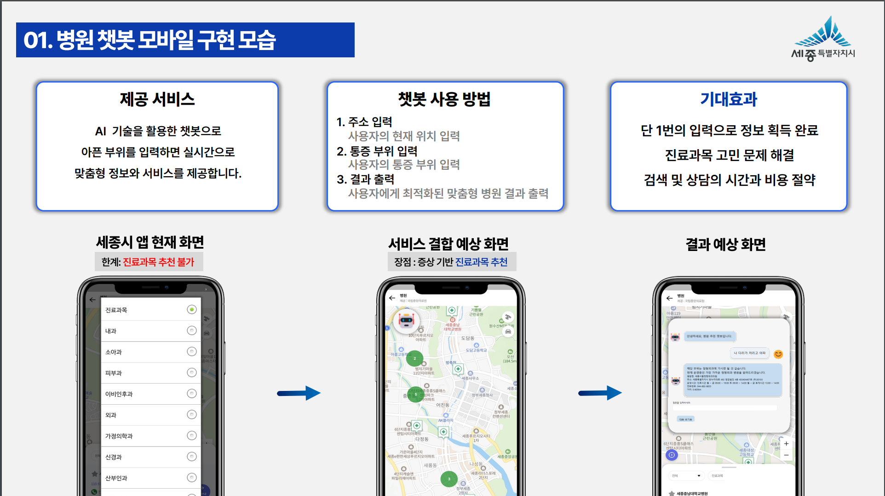
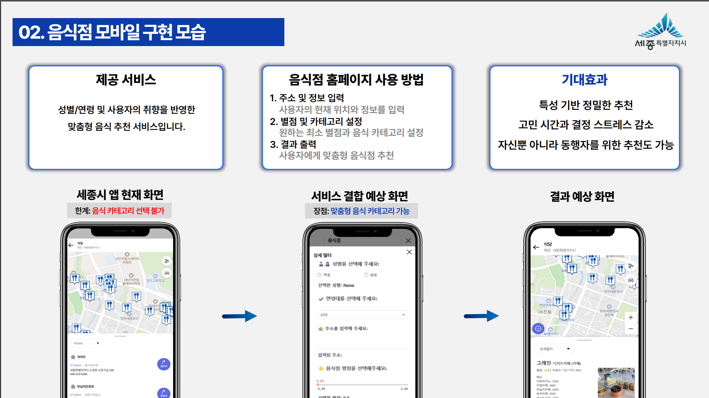

# 세종시 공모전 프로젝트

### 📅 개발 기간  
2024.09.02 ~ 2024.09.30

### 🌟 프로젝트 소개  
- **프로젝트 명:** 세종엔에서 만나는 AI와 빅데이터를 활용한 개인 맞춤형 병원·음식점 추천 시스템  
- **프로젝트 제작 인원:** 4명  

---

### 주요 역할  
담당업무: 데이터 수집 및 분석 시스템 개발  

#### 1. 병원 및 가게 정보 수집  
- 웹 크롤링 기법을 활용하여 병원 및 가게에 대한 정보를 수집한 후, CSV 파일로 저장하였습니다. 이후 저장된 파일을 한 번 더 전처리하여 데이터의 품질을 향상시켰습니다.  

#### 2. 음식점 추천 시스템 개발  
- 웹 크롤링으로 수집한 데이터와 KOSIS(국가통계포털)에서 제공하는 데이터를 기반으로 연령대별 맞춤형 음식점 추천 시스템을 설계 및 개발하였습니다.  

#### 3. 데이터 시각화 및 웹페이지 구현  
- Streamlit을 활용하여 수집된 데이터를 시각화하고, 직관적인 웹페이지를 구현하여 사용자가 쉽게 정보를 탐색하고 활용할 수 있도록 하였습니다.  

---

### 개발 목표  
- 세종시 공모전에 제안된 데이터를 기반으로 사용자 맞춤형 추천 시스템 개발  
- 세종엔 애플리케이션 개선 방향 제안 및 창의적 아이디어 도출  

### 성과  
- 프로젝트 완수 및 공공 데이터를 활용한 창의적 접근으로 **세종시 공모전 참가**  

---

---

### 🌟 프로젝트 이미지

#### 0. 세종시 공모전 포스터
- 아래는 세종엔 프로젝트를 위한 공식 포스터입니다.

### 1. 🌟 프로젝트 목표
- 이 프로젝트는 세종시 공모전에서 개인 맞춤형 추천 시스템 개발을 목표로 진행되었습니다.

---
### 🌟 프로젝트 이미지
- 아래는 프로젝트 발표 자료에서 사용된 대표 슬라이드입니다.
  
  <table align="center">
  <tr>
    <td align="center">
      
      
세종시 공모전 메인 슬라이드

    </td>
    <td align="center">
      
      
세종엔 결합 AI 챗봇 모바일 화면

    </td>
    <td align="center">
      
      
세종엔 결합 맞춤형 음식점 추천 구현 모바일 화면

    </td>
  </tr>
</table>

### 📄 프로젝트 제출 문서
- **세종시 공모전 프로젝트 제출 최종 문서**  
  [세종시 제출 최종-1.pdf](./세종시%20제출%20최종-1.pdf)
  
---

### 🔗 프로젝트 관련 링크

- **웹페이지 URL**: [세종엔 추천 시스템](https://sejong-rb82yem7epu6bcxlpewgfk.streamlit.app)

---

### 📄 프로젝트 상세 설명
- 병원 및 가게 정보를 **크롤링**하여 데이터 수집:
  - Kakao Map을 활용한 데이터 크롤링
- 연령별 음식점 추천:
  - **KOSIS**에서 제공하는 연령대별 소비 패턴 데이터를 분석하여 개인화된 추천
- 웹페이지 구현:
  - **Streamlit**으로 시각화된 데이터를 직관적으로 보여주는 웹 애플리케이션 제작

---

### 🛠 주요 기술 및 도구
- **데이터 수집:** Selenium, BeautifulSoup  
- **데이터 분석:** Pandas, Python  
- **데이터 시각화 및 웹페이지 구현:** Streamlit  

---

