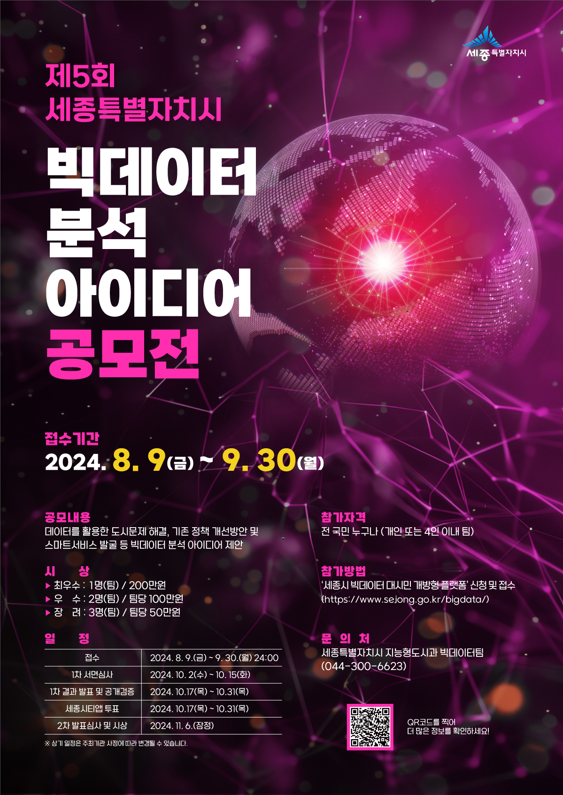
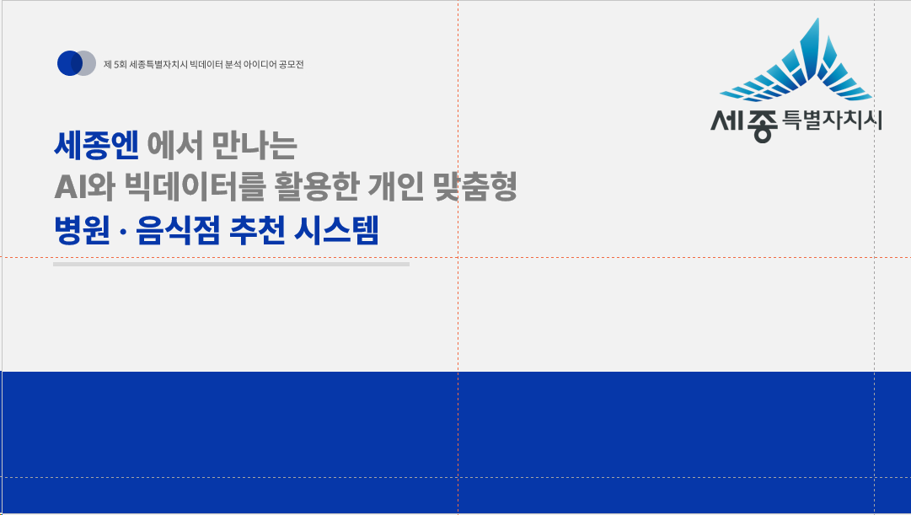
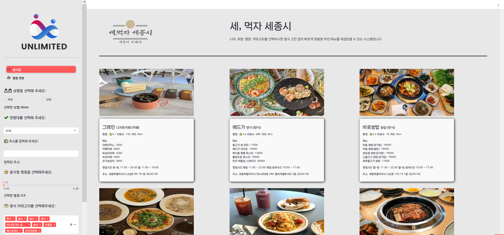

# SejongSi 프로젝트

### 🌟 프로젝트 소개
- **프로젝트 명:** 세종엔에서 만나는 AI와 빅데이터를 활용한 개인 맞춤형 병원·음식점 추천 시스템
- **개발 목표:**  
  - 세종시 공모전에 제안된 데이터를 기반으로 사용자 맞춤형 추천 시스템 개발  
  - 공공 데이터 활용 가능성을 증대  

- **주요 역할:**  
  - 병원 및 가게 정보를 크롤링하여 데이터 수집  
  - **KOSIS**(국가통계포털)에서 제공하는 데이터를 활용해 연령대별 음식점 추천 시스템 개발  
  - **세종시에서 제공하는 공공 데이터**를 활용한 분석 및 통합 시각화  
  - **Streamlit**을 활용한 데이터 시각화 및 웹페이지 구현  

- **성과:**  
  - 프로젝트 완수 및 공공 데이터를 활용한 창의적 접근으로 **세종시 공모전 참가**  

---

### 🌟 프로젝트 이미지

#### 0. 세종시 공모전 포스터
- 아래는 세종엔 프로젝트를 위한 공식 포스터입니다.

### 1. 🌟 프로젝트 포스터
- 이 프로젝트는 세종시 공모전에서 개인 맞춤형 추천 시스템 개발을 목표로 진행되었습니다.

#### 2. 프로젝트 홈페이지

---

### 🛠 주요 기술 및 도구
- **데이터 수집:** Selenium, BeautifulSoup  
- **데이터 분석:** Pandas, Python  
- **데이터 시각화 및 웹페이지 구현:** Streamlit  

---

### 🔗 프로젝트 관련 링크
- **웹페이지 URL:** [세종엔 추천 시스템](https://sejong-rb82yem7epu6bcxlpewgfk.streamlit.app)

---

### 📄 프로젝트 상세 설명
- 병원 및 가게 정보를 **크롤링**하여 데이터 수집:
  - Kakao Map API를 활용한 데이터 크롤링
- 연령별 음식점 추천:
  - **KOSIS**에서 제공하는 연령대별 소비 패턴 데이터를 분석하여 개인화된 추천
- 웹페이지 구현:
  - **Streamlit**으로 시각화된 데이터를 직관적으로 보여주는 웹 애플리케이션 제작

